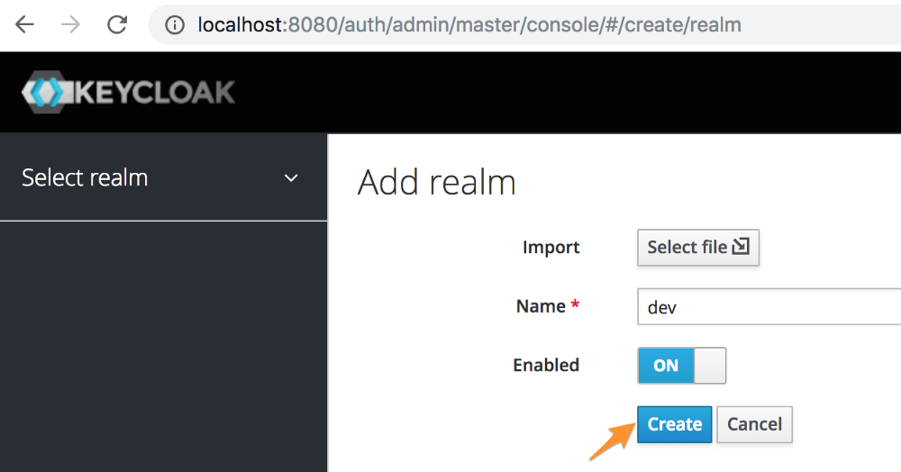
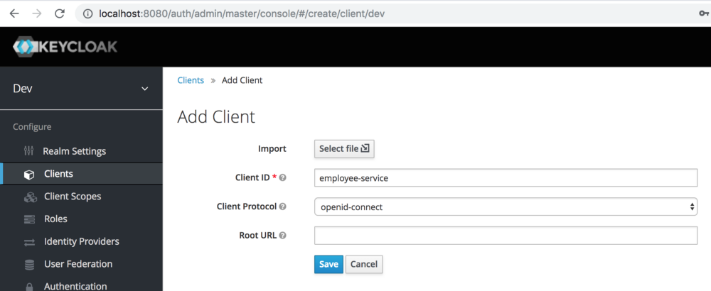
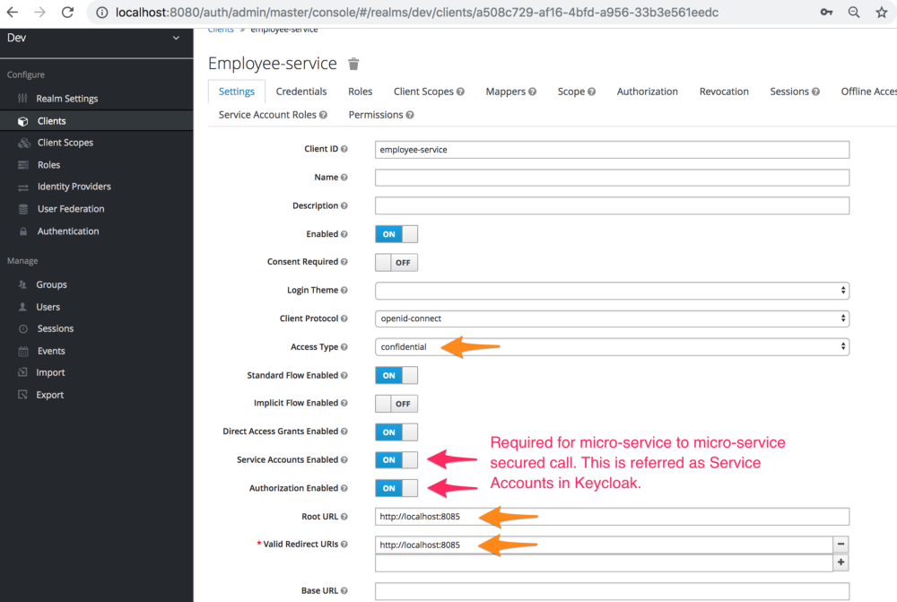
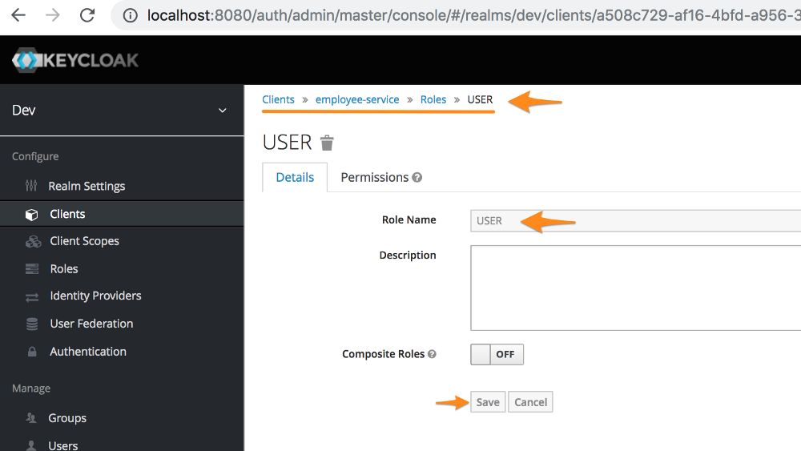
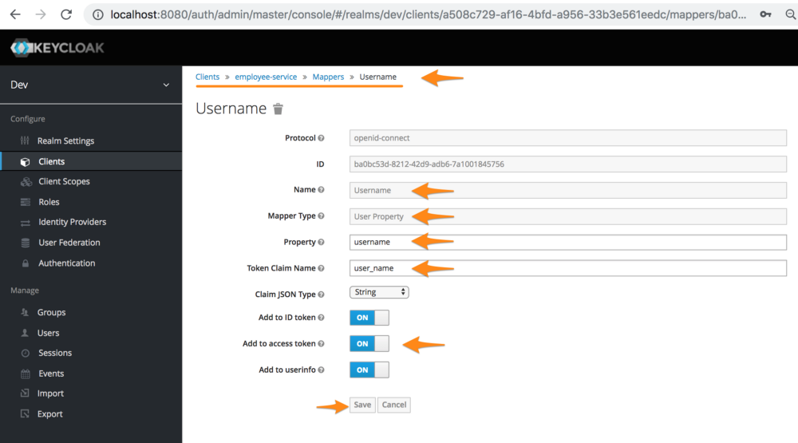
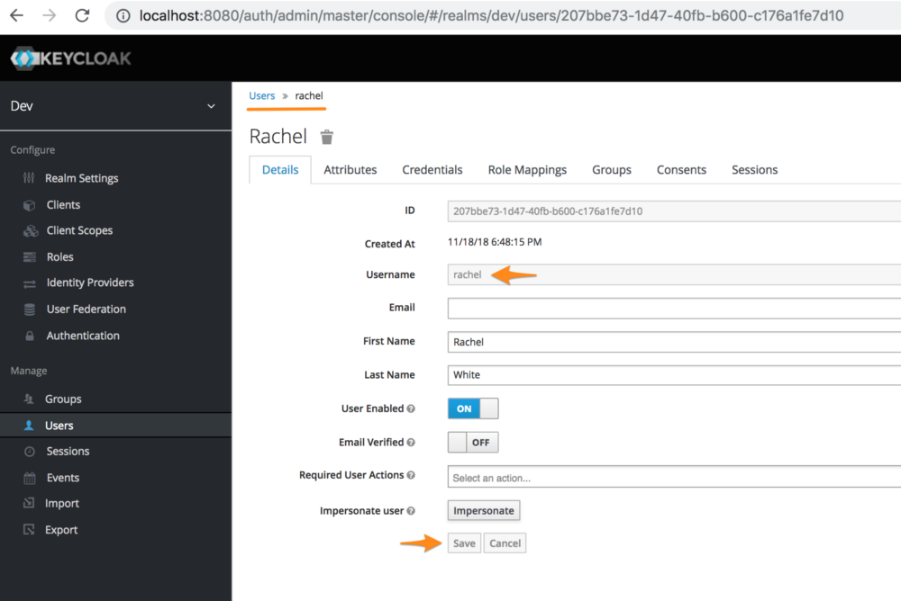
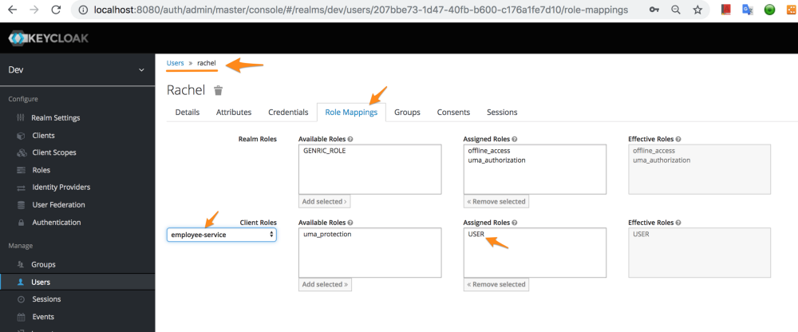
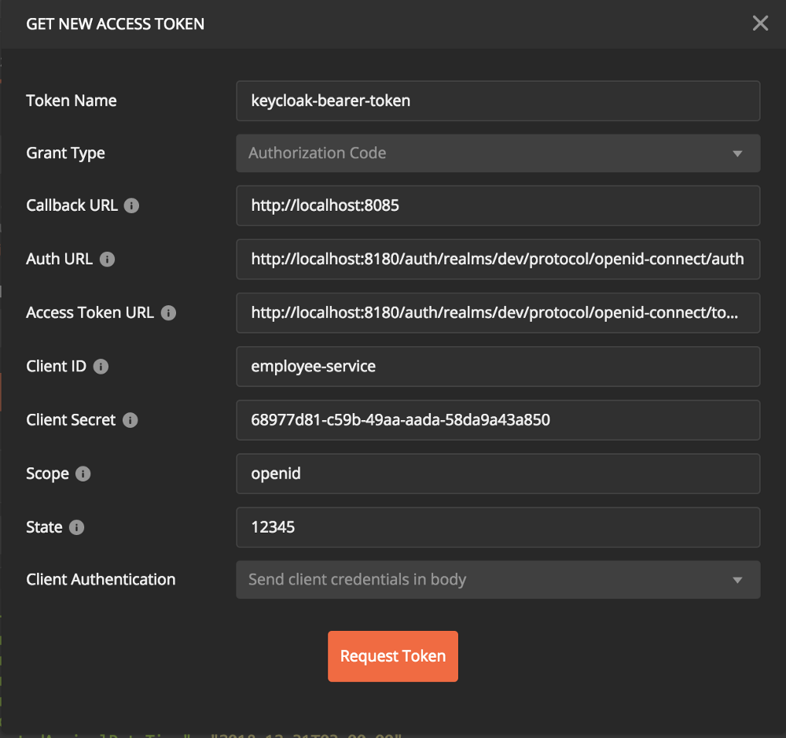
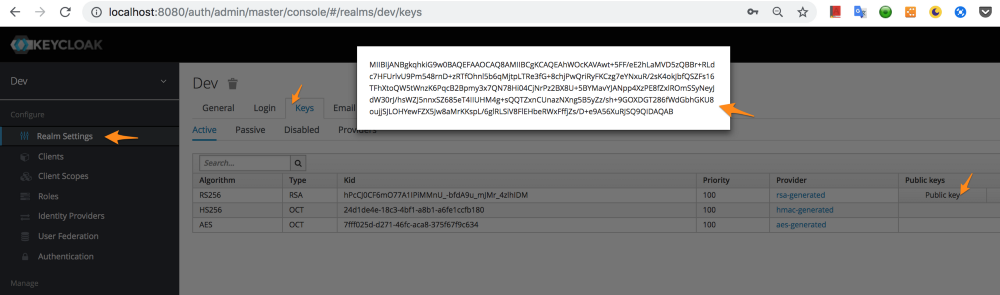

# micropass-oauth2-keycloak-connector

## Securing REST API using Keycloak and Spring Oauth2

Keycloak is Open Source Identity and Access Management Server, which is a OAuth2 and OpenID Connect(OIDC) protocol complaint. This article is to explain how Spring Boot REST APIs can be secured with Keycloak using Spring OAuth2 library.

Keycloak documentation suggest 3 ways to secure Spring based REST APIS.

* Using Keycloak Spring Boot Adapter
* Using keycloak Spring Security Adapter
* Using OpenID Connect (OIDC)+ OAuth2

Let us see how we can use Keycloak OIDC support and Spring OAuth2 library to secure REST APIs. Benefits Of Using Spring OAuth2 Over Keycloak Adapter is explained at the end of this article.

Let us explore how to setup Keycloak and interact with it using Spring OAuth2 library.
This is a lengthy article with step by step instructions, screenshots, code snippets. Complete code is available on github. I recommend reading this article before looking into the code.

## Step 1: Getting Started With Keycloak
Refer Keycloak getting started documentation to run and setup keycloak admin user.

After running Keycloak, access keycloak admin console using 
http://localhost:8080/auth

Setup keycloak username=admin, password=admin.

**Note**: Standalone Keycloak runs on Wildfly server. Don’t worry about configuring a user to manage Wildfly server. We need a Keycloak admin user to create realm, client, user, role etc in Keycloak.

## Step 2: Create dev Realm
Name: dev



## Step 3: Create a Client (Micro-Service)
```
Client ID       : employee-service
Client Protocol : openid-connect
```



## Step 4: Configure Client
If Keycloak runs on Port 8080, make sure your microservice runs on another port. In the example, micro-service is configured to run on 8085.

```
Access Type         : confidential
Valid Redirect URIs : http://localhost:8085
Service Accounts Enabled : On
Authorization Enabled : On
```

**Note**: Access Type confidential supports getting access token using client credentials grant as well as authorization code grant. If a micro-service need to call another micro-service, caller will be ‘confidential’ and callee will be ‘bearer-only’.


Figure 2: Configure client

## Step 5: Create Client Role
Create a role under the client. In this case, role USER is created under employee-service.


Figure 3: Create role

## Step 6: Create a Mapper (To get user_name in access token)
Keycloak access token is a JWT. It is a JSON and each field in that JSON is called a claim. By default, logged in username is returned in a claim named “preferred_username” in access token. Spring Security OAuth2 Resource Server expects username in a claim named “user_name”. Hence, we had to create below mapper to map logged in username to a new claim named user_name.



## Step 7: Create User



## Step 8: Map Client Role To User
In order to provide access to client (micro-service), respective role needs to be assigned/mapped to user.



## Step 9: Get Configuration From OpenID Configuration Endpoint
Because Keycloak is OpenID Connect and OAuth2 complaint, below is OpenID Connection configuration URL to get details about all security endpoints,

GET http://localhost:8080/auth/realms/dev/.well-known/openid-configuration

Important URLS to be copied from response:

issuer : http://localhost:8080/auth/realms/dev

authorization_endpoint: ${issuer}/protocol/openid-connect/auth

token_endpoint: ${issuer}/protocol/openid-connect/token
 
token_introspection_endpoint: ${issuer}/protocol/openid-connect/token/introspect

userinfo_endpoint: ${issuer}/protocol/openid-connect/userinfo

Response also contains grant types and scopes supported

grant_types_supported: ["client_credentials", …]

scopes_supported: ["openid", …]

## To Get Access Token Using Postman (For Testing)
Select Authorization Type as OAuth 2.0, click on ‘Get New Access Token’ and enter following details.




Postman tool screenshot: To get access token from keycloak for a client

Make sure you select client authentication as “Send client credentials in body” while requesting token.
Callback URL is redirect URL configured in Keycloak.
Client secret may be different for you, copy the one from client configuration in keycloak.
You may also use https://jwt.io to inspect the contents of token received.


## Step 10: Create a Spring Boot Application
Spring Boot

```
<parent>
  <groupId>org.springframework.boot</groupId>
  <artifactId>spring-boot-starter-parent</artifactId>
  <version>2.0.1.RELEASE</version>
  <relativePath/> <!-- lookup parent from repository -->
</parent>
```

Dependencies

```
<dependency>
  <groupId>org.springframework.boot</groupId>
  <artifactId>spring-boot-starter</artifactId>
</dependency>
<dependency>
  <groupId>org.springframework.boot</groupId>
  <artifactId>spring-boot-starter-security</artifactId>
</dependency>
<dependency>
  <groupId>org.springframework.security.oauth.boot</groupId>
  <artifactId>spring-security-oauth2-autoconfigure</artifactId>
  <version>2.0.1.RELEASE</version>
</dependency>
<dependency>
  <groupId>org.springframework.boot</groupId>
  <artifactId>spring-boot-starter-web</artifactId>
</dependency>
```

## Step 11: Configure application.properties
General Security Properties

```
# Can be set to false to disable security during local development
rest.security.enabled=true
rest.security.api-matcher=/api/**
rest.security.cors.allowed-origins=*
rest.security.cors.allowed-headers=*
rest.security.cors.allowed-methods=GET,POST,PUT,PATCH,DELETE,OPTIONS
rest.security.cors.max-age=3600
```

Properties to secure REST Endpoints using OAuth2 Resource Server

```
rest.security.issuer-uri=http://localhost:8080/auth/realms/dev
security.oauth2.resource.id=employee-service
security.oauth2.resource.token-info-uri=${rest.security.issuer-uri}/protocol/openid-connect/token/introspect
security.oauth2.resource.user-info-uri=${rest.security.issuer-uri}/protocol/openid-connect/userinfo
security.oauth2.resource.jwt.key-value=-----BEGIN PUBLIC KEY-----\nMIIBIjANBgkqhkiG9w0BAQEFAAOCAQ8AMIIBCgKCAQEAhWOcKAVAwt+5FF/eE2hLaMVD5zQBBr+RLdc7HFUrlvU9Pm548rnD+zRTfOhnl5b6qMjtpLTRe3fG+8chjPwQriRyFKCzg7eYNxuR/2sK4okJbfQSZFs16TFhXtoQW5tWnzK6PqcB2Bpmy3x7QN78Hi04CjNrPz2BX8U+5BYMavYJANpp4XzPE8fZxlROmSSyNeyJdW30rJ/hsWZJ5nnxSZ685eT4IIUHM4g+sQQTZxnCUnazNXng5B5yZz/sh+9GOXDGT286fWdGbhGKU8oujjSJLOHYewFZX5Jw8aMrKKspL/6glRLSiV8FlEHbeRWxFffjZs/D+e9A56XuRJSQ9QIDAQAB\n-----END PUBLIC KEY-----
```



**Note 1**: security.oauth2.resource.jwt.key-value property value can be copied from public key at realm level. This is very important and this property is what uses JwtAccessTokenCustomizer which we will see later.

**Note 2**: Property values will be different based on your configuration, care should be take to use correct values.

Properties to call another micro-service (Service Accounts)

```
# If this micro-services that needs to call another 
# secured micro-service
security.oauth2.client.client-id=employee-service
security.oauth2.client.client-secret=68977d81-c59b-49aa-aada-58da9a43a850
security.oauth2.client.user-authorization-uri=${rest.security.issuer-uri}/protocol/openid-connect/auth
security.oauth2.client.access-token-uri=${rest.security.issuer-uri}/protocol/openid-connect/token
security.oauth2.client.scope=openid
security.oauth2.client.grant-type=client_credentials
```

**Note**: Above properties are required for OAuth2RestTemplate that is used to make secure service account calls.

